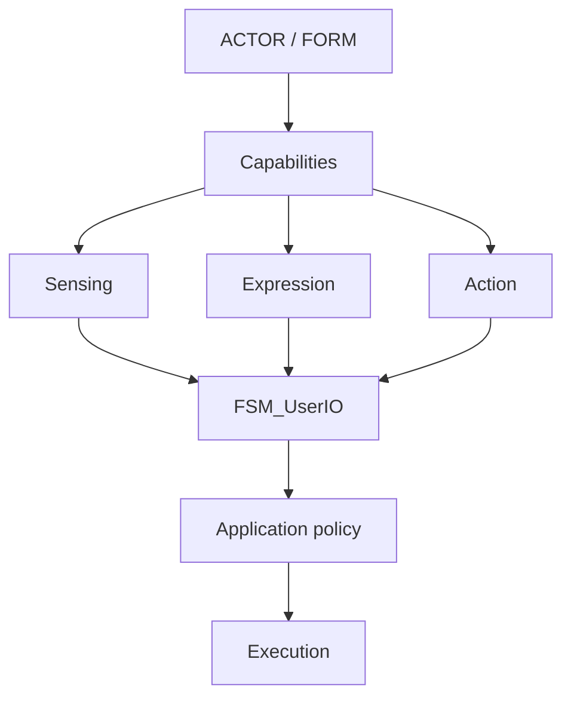
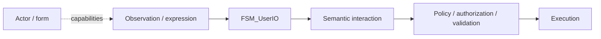
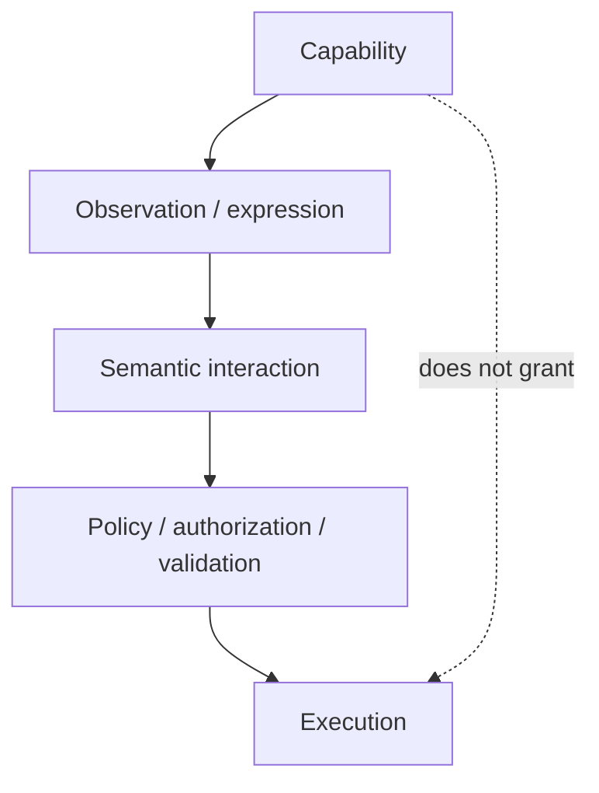
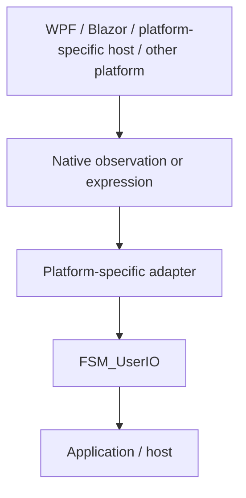
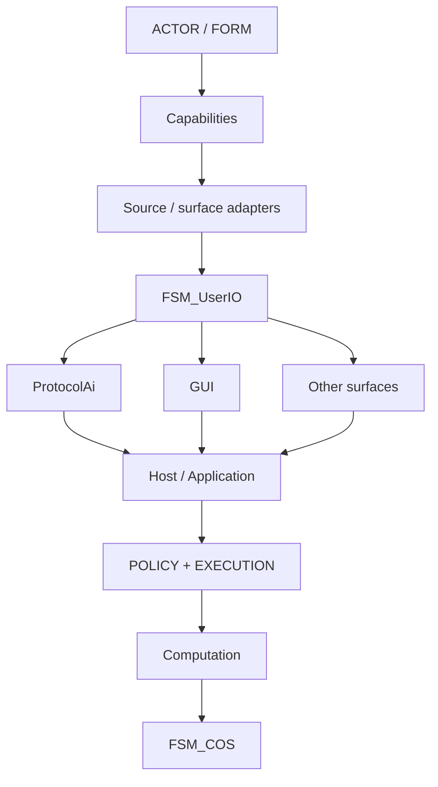

# TheSingularityWorkshop.FSM_UserIO

[](https://www.nuget.org/packages/TheSingularityWorkshop.FSM_UserIO)
[](https://www.nuget.org/packages/TheSingularityWorkshop.FSM_UserIO)
[](https://github.com/TrentBest/FSM_UserIO/actions/workflows/build.yml)
[](https://codecov.io/gh/TrentBest/FSM_UserIO)
[](LICENSE.txt)
[](https://github.com/TrentBest/FSM_UserIO/commits/master)
[](https://github.com/TrentBest/FSM_UserIO/issues)
[](https://dotnet.microsoft.com/)

**The Singularity Workshop UserIO boundary: semantic interaction across forms, capabilities, observations, expression, and computation.**

FSM_UserIO is a platform-neutral semantic interaction boundary. It is not a human-input library, a game-engine input layer, or a GUI event abstraction.

The package begins from a more fundamental question:

> **What can the interacting form sense, express, or perform, and what semantic interaction does that capability produce?**

A human is one possible form. A dog is another. A robot, VR avatar, accessibility system, AI agent, remote operator, or software process can also be an interacting form. The common abstraction is not anatomy and it is not a device. It is **capability**.

## What and Why

FSM_UserIO defines the semantic boundary between an observation or expression and the application meaning that may follow. A keyboard event, gaze signal, voice utterance, robot sensor, software message, or agent proposal is not automatically an instruction to execute. The application retains ownership of policy, authorization, validation, and execution.

The package starts with a small shared representation: `SemanticIntent`. It does not own devices, GUI events, the originating actor, or application behavior.

## 60-Second Quick Start

### 1. Create a project in Visual Studio

Choose **Create a new project → Console App**, select C#, and target **.NET 8**.

### 2. Open the Developer Terminal

Choose **View → Terminal** and ensure it is in the directory containing your project's `.csproj` file.

### 3. Install FSM_UserIO

```powershell
dotnet add package TheSingularityWorkshop.FSM_UserIO --version 0.1.0-alpha.1
```

### 4. Replace `Program.cs` with this example

```csharp
using TheSingularityWorkshop.FSM_UserIO;

var intent = new SemanticIntent("open-settings");

Console.WriteLine($"Intent: {intent.Name}");
Console.WriteLine(intent.ProtocolId is null
    ? "Protocol identity: not assigned"
    : $"Protocol identity: {intent.ProtocolId}");
```

Expected output:

```text
Intent: open-settings
Protocol identity: not assigned
```

This creates a semantic intent value. It does not authorize or execute the requested action; your application still decides what the intent means and whether it is allowed.

## Add It to an Existing Project

Already have an application? Add the package to the project where you translate a source observation into application-owned semantic meaning:

```powershell
dotnet add package TheSingularityWorkshop.FSM_UserIO --version 0.1.0-alpha.1
```

For example, an event adapter may map a UI action or service message to `new SemanticIntent("open-settings")`. Keep raw device/framework event types in the adapter and keep authorization, validation, and execution in the host/application.

Do not add FSM_UserIO merely to pass through an unmodified device event. Use it when a stable semantic interaction boundary is useful to your architecture.

## The vision

The Workshop does not want UserIO constrained by the conventions of platform-specific host, WPF, Blazor, another game engine, or the human keyboard-and-mouse model.

Those are manifestations of computation.

FSM_UserIO sits at the semantic boundary beneath them:



The upper limit is therefore not "what a human can do with a controller" or "what platform-specific host exposes." The boundary is constrained by the capabilities that can be represented and by the computation that can process them.

## Why this package exists

A keyboard key, mouse movement, controller button, paw gesture, gaze event, voice utterance, accessibility action, automation signal, software message, or AI proposal is **not itself application meaning**.

It is an observation, expression, or proposal produced through some capability.

FSM_UserIO exists to carry the semantic interaction across that boundary without taking ownership of the source, the GUI, the datum, or execution.



That gives the Workshop a stable separation:

| Concern | Owner |
|---|---|
| Actor/form and its real capabilities | originating system / application |
| Physical or software observation | source adapter |
| Semantic interaction | FSM_UserIO |
| Deterministic semantic identity | ProtocolAi |
| Structural composition | GrammarAi |
| Human-facing semantic presentation | GUI |
| Domain datum and domain meaning | application/domain |
| Policy, authorization, validation, execution | host/application |
| Runtime composition | FSM_COS |
| Native manifestation/rendering | platform-specific package |

## Capability is the important abstraction

Capability is broader than input.

A capability can describe what a form can **sense**, **express**, or **perform**.

Examples are intentionally illustrative rather than an ontology:

| Form | Possible capabilities |
|---|---|
| Human | vision, hearing, speech, grasping, locomotion, typing |
| Dog | vision, hearing, smell, barking, biting, locomotion |
| Robot | sensors, locomotion, manipulation, speech, network interaction |
| VR avatar | application-granted perception, locomotion, manipulation, expression |
| AI agent | semantic observation, proposal, planning, software interaction |
| Software process | messages, API calls, files, events, service operations |
| Accessibility system | gaze, switches, speech, specialized controls |

The point is **not** to encode these examples as a giant universal capability enum.

The point is to avoid making the core accidentally assume that every user is a biped holding a controller.

### Capability is not authority

A capability does not grant permission.

A dog may be physically capable of biting. A human may be capable of deleting a record. An AI agent may be capable of proposing `DeleteAccount`. A software process may be capable of invoking an API.

Whether any of those interactions are meaningful, permitted, authorized, or executable belongs to application policy.



This separation is fundamental to the package.

## What FSM_UserIO is not

FSM_UserIO is deliberately **not**:

- a keyboard or mouse API;
- a controller abstraction;
- a WPF input framework;
- a Blazor event framework;
- a platform-specific host input layer;
- a game-engine abstraction;
- a device SDK;
- a rendering system;
- a GUI widget library;
- an authorization system;
- an application command executor;
- a replacement for ProtocolAi or GrammarAi.

Those concerns may have adapters or bridge packages. They do not belong in the semantic core merely because one consumer happens to need them.

## Platform independence

Do **not** read "UserIO" as "human I/O."

The name describes the application boundary through which an interacting form reaches semantic interaction.

Likewise, do not assume that every platform needs a package named `WPF_IO`, `Blazor_IO`, or `Unity_IO`. A platform-specific adapter should exist only when a real shared contract justifies it.



If several platforms share a capability, the shared bridge belongs at the smallest boundary that actually owns that capability. This is the same minimum-intersection principle used elsewhere in the Workshop.

## The Workshop stack

FSM_UserIO does not replace the other Workshop packages. It gives them a clean boundary to meet at:



ProtocolAi can give application-owned symbols deterministic identity.

GrammarAi can describe how those identities are structurally composed.

GUI can mediate human-facing presentation and interaction with datum.

FSM_COS can compose runtime capabilities.

None of those relationships require FSM_UserIO to depend upward on them.

## Alpha 1

Alpha 1 deliberately starts with one semantic artifact:

```csharp
public sealed record SemanticIntent(string Name, ulong? ProtocolId = null);
```

This is intentionally small.

It establishes that an application-owned semantic interaction can have:

- a required application-defined name;
- an optional deterministic numeric identity;
- no embedded device type;
- no GUI type;
- no rendering type;
- no authorization policy;
- no execution behavior.

The package will grow only when a real boundary requires another contract and that contract can be demonstrated with tests and a consumer.

## Documentation

Start with:

- [Theory](docs/THEORY.md) — the conceptual boundary and capability model.
- [Architecture](docs/ARCHITECTURE.md) — ownership and dependency direction.
- [Development](docs/DEVELOPMENT.md) — contribution and design rules.
- [Roadmap](docs/ROADMAP.md) — deliberately staged API evolution.
- [Alpha readiness](docs/ALPHA_READINESS.md) — the Alpha 1 release gate.

The documentation is part of the API. It exists to prevent future consumers from accidentally importing a game-engine or human-device interpretation into a package intended to remain computation-bound rather than platform-bound.

## NuGet publication

Publication is intentionally disabled by default.

The Workshop-wide release safety rule is that NuGet publication jobs end with an explicit `&& false` gate. Build, test, coverage, and package creation remain useful while publication stays off.

The release procedure is documented in the Workshop's [NuGet Publication Runbook](https://github.com/TrentBest/TheSingularityWorkshop.FSM_COS/blob/master/docs/RELEASING.md).

## License

MIT. See [LICENSE.txt](LICENSE.txt).

---

<p align="center">
  <em>The Singularity Workshop — edify, don't mystify.</em>
</p>
